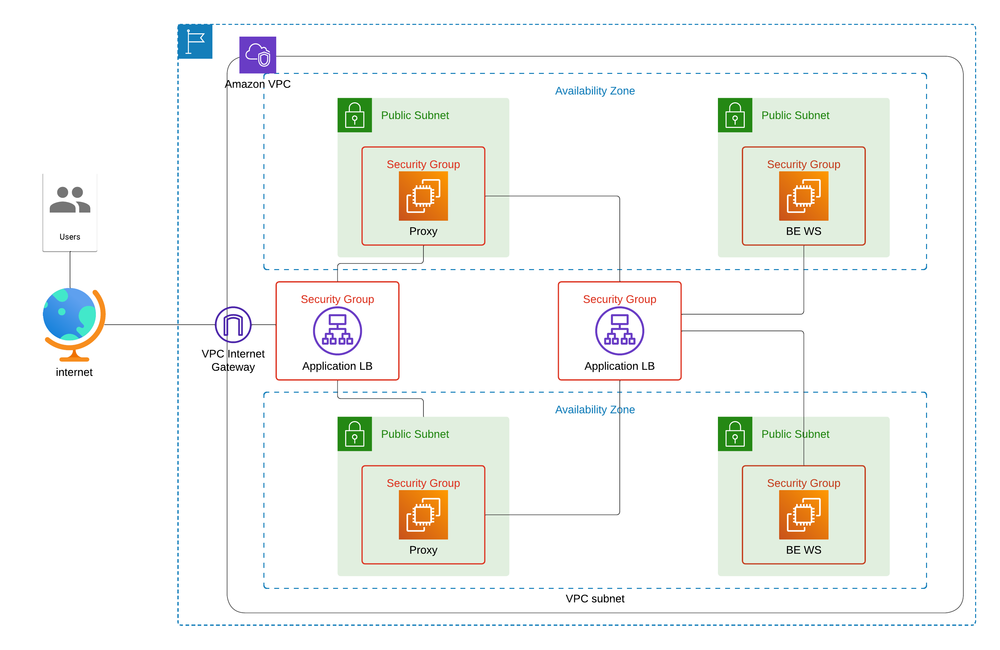

# AWS Architecture Deployment with Terraform

## Overview
This Terraform project sets up an AWS infrastructure with load balancers, reverse proxy and web server EC2 instances, autoscaling, and network configuration within a VPC. This design ensures scalable and secure web hosting, with organized modules for ease of maintenance and reusability.

## Project Structure

- **autoscalling.tf**: Defines autoscaling resources.
- **backend.tf**: Configures remote backend using S3 for state storage and DynamoDB for state locking.
- **instances.tf**: Defines EC2 instances and AMI data sources.
- **keypair.tf**: Manages SSH key pairs for accessing instances.
- **loadbalancers.tf**: Configures application load balancers for traffic distribution.
- **network.tf**: Sets up VPC, subnets, and internet gateways.
- **securitygroups.tf**: Defines security group rules.
- **variables.tf** and **terraform.tfvars**: Holds customizable input variables for different environments.

## Requirements

### 1. Workspace
- Create a Terraform workspace named `dev` for deployment.

### 2. Configure `terraform.tfvars`
Update `terraform.tfvars` with necessary variables such as instance types, VPC IDs, and subnet IDs.

### 3. Backend Configuration
1. Create an **S3 bucket** in the AWS console for storing Terraform state with deletion protection.
2. Create a **DynamoDB table** with `LockID` as the partition key for state locking.
3. Update the `backend.tf` file with the S3 bucket and DynamoDB table details.

### 4. Provisioning with `remote-exec` and `local-exec`
Uses **remote-exec** and **local-exec** provisioners to configure the proxy and web server instances.

### 5. Proxy Instances
Reverse proxies (using Nginx) forward requests to an internal load balancer.

### 6. Web Server Instances
The web server instances are configured to serve content through an internal load balancer (LB2) located in private subnets.

### 7. Load Balancer Configuration
The architecture includes two load balancers:

- **Load Balancer 1 (Public)**: Receives incoming traffic and directs it to the reverse proxy instances in public subnets.
- **Load Balancer 2 (Internal)**: Distributes traffic from the proxies to the web servers in private subnets.